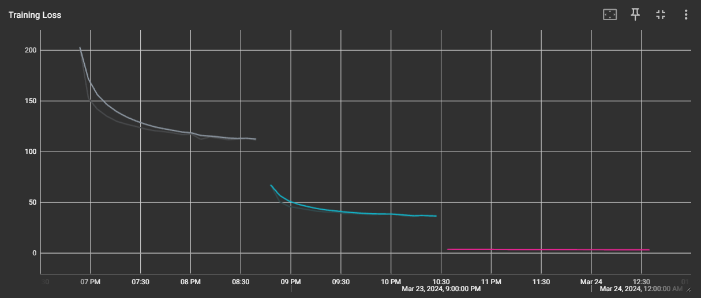
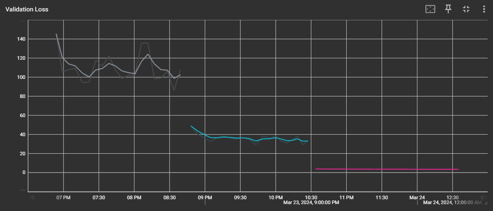
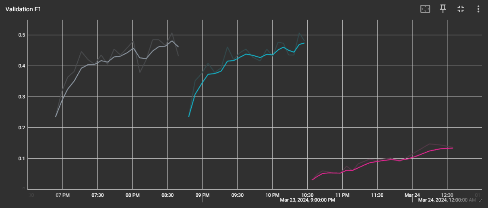

# Playing Cards Classification
### About
This repository contains code that solves the [Playing Cards Classification dataset](https://www.kaggle.com/datasets/gpiosenka/cards-image-datasetclassification) by training a **ResNet18** model. The repository is made for a laboratory work in Deep Learning class during my masters education in [Baku Higher Oil School](https://bhos.edu.az/) in Informatics and Control in Technical Systems.

### Task Specifications
The task in the laboratory work asks the student to use the **ResNet18** model as the feature extractor, and train the classifier according to the given data. The training and validation should be run for 20 epochs with three different configurations with learning rates of **1.5**, **0.5** and **0.00005**. The tensorboard logs should be included in the results, for the comparison of **Loss** and **F1 scores** of training and validation. The laboratory work also requires a report made in $` \LaTeX `$ format.

### Results
I have trained the **ResNet18** model with the modified classifier with three different learning rates, as given in the task. The graphs for *Training Loss*, *Validation Loss* and *Validation F1 Score* are given below:

---

---

---

---

### Conclusion
As a conclusion, one can say that the learning rate **1.5** is too much, and the plots for *Training Loss* and *Validation Loss* prove this point. The model is "learning" from the training batch, but for validation, the loss does not decrease correspondingly, and has fluctuations. For the learning rate **0.5**, the model is not steadily increasing its F1 score too, after increasing for a while, it hits some fluctuations, and there is no progress. We still cannot judge, because the training was only 20 epochs. But the learning rate **0.00005** is definitely too low, because the F1 score increases steadily, but does not seem to get anywhere in just 20 epochs. Perhaps the model can perform better, with a little higher learning rate, something like **0.001**, and with a higher epoch count, for example 500 epochs.
